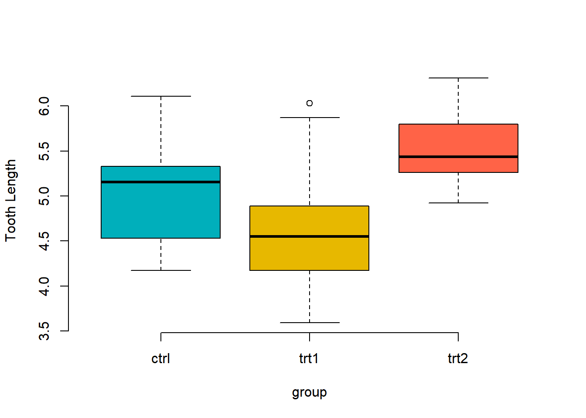

# 일원분류 분산분석(One way ANOVA)

## 데이터 불러오기

```r
data(PlantGrowth)
str(PlantGrowth)
```

```
## 'data.frame':	30 obs. of  2 variables:
##  $ weight: num  4.17 5.58 5.18 6.11 4.5 4.61 5.17 4.53 5.33 5.14 ...
##  $ group : Factor w/ 3 levels "ctrl","trt1",..: 1 1 1 1 1 1 1 1 1 1 ...
```

```r
levels(PlantGrowth$group)
```

```
## [1] "ctrl" "trt1" "trt2"
```

R에 있는 기본 데이터셋인 PlantGrowth를 불러온다.

2개의 변수와 60개의 관측치가 있다.

group에는 3가지 요인(ctrl, trt1, trt2)이 있다.

## 일원분류 분산분석이란

**분산분석이란**
두 개의 집단의 평균의 비교할때, T-test를 사용했다.

분산분석은 3개 이상의 집단의 평균을 비교할때 사용한다.

여기서 말하는 집단은 독립변수의 요인 개수이다.

그리고 종속변수의 집단에 따라 분산분석이 나뉘어 진다.


**일원분류 분산분석이란**
종속변수(한 개 집단) ~ 독립변수(3개 이상 집단) 일때, 평균을 비교하는 기법이다.


```r
boxplot(weight ~ group, 
        data=PlantGrowth,
        frame = FALSE, 
        col = c("#00AFBB", "#E7B800","tomato"),
        ylab="Tooth Length")
```



boxplot으로 나타내면 위와 같이 구성되어 있다.


## 전제조건
분산분석을 사용하기 위해서는 독립성, 등분산성, 독립성을 만족해야 한다.


### 정규성


```r
str(PlantGrowth)
```

```
## 'data.frame':	30 obs. of  2 variables:
##  $ weight: num  4.17 5.58 5.18 6.11 4.5 4.61 5.17 4.53 5.33 5.14 ...
##  $ group : Factor w/ 3 levels "ctrl","trt1",..: 1 1 1 1 1 1 1 1 1 1 ...
```

```r
with(data = PlantGrowth,shapiro.test(weight[group=="ctrl"]))
```

```
## 
## 	Shapiro-Wilk normality test
## 
## data:  weight[group == "ctrl"]
## W = 0.95668, p-value = 0.7475
```

```r
with(data = PlantGrowth,shapiro.test(weight[group=="trt1"]))
```

```
## 
## 	Shapiro-Wilk normality test
## 
## data:  weight[group == "trt1"]
## W = 0.93041, p-value = 0.4519
```

```r
with(data = PlantGrowth,shapiro.test(weight[group=="trt2"]))
```

```
## 
## 	Shapiro-Wilk normality test
## 
## data:  weight[group == "trt2"]
## W = 0.94101, p-value = 0.5643
```

표본이 충분하기 때문에(30개 이상) clt와 대수의 법칙에 따라 정규성이 있다.

이전에 배운 정규성 검정을 연습해보았을때,

3개의 집단 모두 유의하기 때문에 정규성이 있다.

### 등분산성


```r
bartlett.test(weight~group, data = PlantGrowth)
```

```
## 
## 	Bartlett test of homogeneity of variances
## 
## data:  weight by group
## Bartlett's K-squared = 2.8786, df = 2, p-value = 0.2371
```


```r
library(car)
```

```
## Loading required package: carData
```

```r
leveneTest(weight~group, data = PlantGrowth)
```

```
## Levene's Test for Homogeneity of Variance (center = median)
##       Df F value Pr(>F)
## group  2  1.1192 0.3412
##       27
```

모수적 방법을 이용한다.

두 가지 모두 사용해 본다. 둘 다 p값이 유의하지 않기 때문에 등분산성이 있다.


### 독립성


```r
ctrl <- with(data = PlantGrowth, weight[group=="ctrl"])

trt1 <- with(data = PlantGrowth, weight[group=="trt1"])

trt2 <- with(data = PlantGrowth, weight[group=="trt2"])

cov(ctrl, trt1)
```

```
## [1] -0.2118022
```

```r
cov(ctrl, trt2)
```

```
## [1] -0.1206244
```

```r
cov(trt1, trt2)
```

```
## [1] -0.04887333
```

3개의 집단을 두 개씩 독립성 검정을 했을때, 공분산이 거의 0에 가깝다.

따라서, 서로 독립적이다.


## One-way ANOVA test
귀무가설 : 모든 평균들은 다 같다.

대체가설 : 평균들이 모두 같지는 않다. (’평균들이 모두 다르다’가 아니다.)


```r
plant.aov <- aov(weight~group, data = PlantGrowth)

summary(plant.aov)
```

```
##             Df Sum Sq Mean Sq F value Pr(>F)  
## group        2  3.766  1.8832   4.846 0.0159 *
## Residuals   27 10.492  0.3886                 
## ---
## Signif. codes:  0 '***' 0.001 '**' 0.01 '*' 0.05 '.' 0.1 ' ' 1
```
p값이 유의수준보다 작기 때문에 통계적으로 유의하다.

따라서, 3개의 집단의 평균들은 모두 같지는 않다.


## 다중비교
3개의 집단 평균들이 모두 같지 않다는 것은 알았다.

하지만 어떤 집단이 다르며, 어떠한 차이가 있는지 알 수 없었다.

그 내용을 다중비교를 통해 알 수 있다.(3가지 방법)

### TukeyHSD


```r
TukeyHSD(plant.aov)
```

```
##   Tukey multiple comparisons of means
##     95% family-wise confidence level
## 
## Fit: aov(formula = weight ~ group, data = PlantGrowth)
## 
## $group
##             diff        lwr       upr     p adj
## trt1-ctrl -0.371 -1.0622161 0.3202161 0.3908711
## trt2-ctrl  0.494 -0.1972161 1.1852161 0.1979960
## trt2-trt1  0.865  0.1737839 1.5562161 0.0120064
```
TukeyHSD 함수는 두 개씩 짝을 지어 비교를 해준다.

p adj를 보면 trt2와 trt1이 유의수준(0.05)보다 작아 통계적으로 유의하다.

따라서, trt2와 trt1에서 평균의 차이가 있다고 해석한다.


+ diff: 두 집단의 평균 차이
+ lwr, upr: 95% 신뢰구간에서 하한값과 상한값
+ p adj: 조정된 p값


+ glht

++ glht() : 일반화된 선형 가설 검정에 쓰임

++ glht(model, lincft)
+ linfct : linear, 함수가 지정되어야 함


```r
library(multcomp)
```

```
## Loading required package: mvtnorm
```

```
## Loading required package: survival
```

```
## Loading required package: TH.data
```

```
## Loading required package: MASS
```

```
## 
## Attaching package: 'TH.data'
```

```
## The following object is masked from 'package:MASS':
## 
##     geyser
```

```r
summary(glht(plant.aov, linfct = mcp(group="Tukey")))
```

```
## 
## 	 Simultaneous Tests for General Linear Hypotheses
## 
## Multiple Comparisons of Means: Tukey Contrasts
## 
## 
## Fit: aov(formula = weight ~ group, data = PlantGrowth)
## 
## Linear Hypotheses:
##                  Estimate Std. Error t value Pr(>|t|)  
## trt1 - ctrl == 0  -0.3710     0.2788  -1.331   0.3909  
## trt2 - ctrl == 0   0.4940     0.2788   1.772   0.1980  
## trt2 - trt1 == 0   0.8650     0.2788   3.103   0.0122 *
## ---
## Signif. codes:  0 '***' 0.001 '**' 0.01 '*' 0.05 '.' 0.1 ' ' 1
## (Adjusted p values reported -- single-step method)
```

TukeyHSD와 같은 결과이다.

mcp: group을 만드는 함수로 Tukey 함수를 쓰겠다.


```r
pairwise.t.test
```

```
## function (x, g, p.adjust.method = p.adjust.methods, pool.sd = !paired, 
##     paired = FALSE, alternative = c("two.sided", "less", "greater"), 
##     ...) 
## {
##     if (paired & pool.sd) 
##         stop("pooling of SD is incompatible with paired tests")
##     DNAME <- paste(deparse1(substitute(x)), "and", deparse1(substitute(g)))
##     g <- factor(g)
##     p.adjust.method <- match.arg(p.adjust.method)
##     alternative <- match.arg(alternative)
##     if (pool.sd) {
##         METHOD <- "t tests with pooled SD"
##         xbar <- tapply(x, g, mean, na.rm = TRUE)
##         s <- tapply(x, g, sd, na.rm = TRUE)
##         n <- tapply(!is.na(x), g, sum)
##         degf <- n - 1
##         total.degf <- sum(degf)
##         pooled.sd <- sqrt(sum(s^2 * degf)/total.degf)
##         compare.levels <- function(i, j) {
##             dif <- xbar[i] - xbar[j]
##             se.dif <- pooled.sd * sqrt(1/n[i] + 1/n[j])
##             t.val <- dif/se.dif
##             if (alternative == "two.sided") 
##                 2 * pt(-abs(t.val), total.degf)
##             else pt(t.val, total.degf, lower.tail = (alternative == 
##                 "less"))
##         }
##     }
##     else {
##         METHOD <- if (paired) 
##             "paired t tests"
##         else "t tests with non-pooled SD"
##         compare.levels <- function(i, j) {
##             xi <- x[as.integer(g) == i]
##             xj <- x[as.integer(g) == j]
##             t.test(xi, xj, paired = paired, alternative = alternative, 
##                 ...)$p.value
##         }
##     }
##     PVAL <- pairwise.table(compare.levels, levels(g), p.adjust.method)
##     ans <- list(method = METHOD, data.name = DNAME, p.value = PVAL, 
##         p.adjust.method = p.adjust.method)
##     class(ans) <- "pairwise.htest"
##     ans
## }
## <bytecode: 0x0000000021602948>
## <environment: namespace:stats>
```

```r
pairwise.t.test(PlantGrowth$weight, PlantGrowth$group, p.adjust.method = "BH")
```

```
## 
## 	Pairwise comparisons using t tests with pooled SD 
## 
## data:  PlantGrowth$weight and PlantGrowth$group 
## 
##      ctrl  trt1 
## trt1 0.194 -    
## trt2 0.132 0.013
## 
## P value adjustment method: BH
```

결과를 교차표로 만들어 준다.

## 비모수일때
만약 표본이 작거나 정규성을 따르지 않을때
kruskal.test 함수를 사용한다.


```r
kruskal.test(weight ~ group, data = PlantGrowth)
```

```
## 
## 	Kruskal-Wallis rank sum test
## 
## data:  weight by group
## Kruskal-Wallis chi-squared = 7.9882, df = 2, p-value = 0.01842
```

