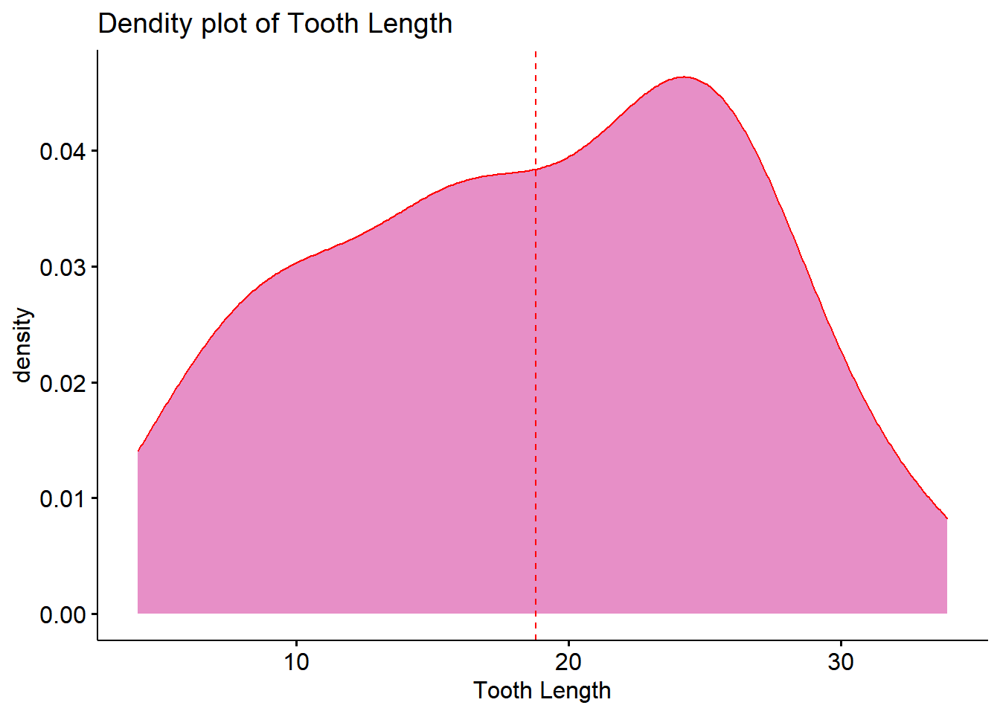

# 정규성 검정(Normality Test)

## 데이터 불러오기

```r
my.data <- ToothGrowth
str(my.data)
```

```
## 'data.frame':	60 obs. of  3 variables:
##  $ len : num  4.2 11.5 7.3 5.8 6.4 10 11.2 11.2 5.2 7 ...
##  $ supp: Factor w/ 2 levels "OJ","VC": 2 2 2 2 2 2 2 2 2 2 ...
##  $ dose: num  0.5 0.5 0.5 0.5 0.5 0.5 0.5 0.5 0.5 0.5 ...
```

R에 있는 기본 데이터셋인 ToothGrowth를 불러온다.
3개의 변수와 60개의 관측치가 있다.

## 정규성 검정이란
데이터셋의 분포가 정규분포를 따르는지 검정하는 것을 말한다.

데이터셋이 정규분포를 따라야, 다양한 분석 이론을 적용시킬 수 있다.

만일, 정규분포를 따르지 않는다면 데이터 먼징하거나 비모수적 방법을 사용한다.

## 중요한 두 법칙
다음 두 법칙으로 인해, 대표본(n>=30)인 경우 데이터셋은 정규분포를 따른다.


**중심극한의 정리(C.L.T - Central Limit Theorem)**

+ 표본의 평균은 표본의 크기가 커질수록, 정규분표와 유사해진다.

+ 모집단이 정규분포하지 않더라도 표본의 크기가 충분히 크다면, 정규분포라고 가정할 수 있다. 


**대수의 법칙**

+ 표본의 크기가 증가할수록, 통계적 추정의 정밀도가 향상된다는 것을 수학적으로 증명

+ 표본의 크기가 커짐에 따라 표본에서 계산한 평균값과 모집단의 실제평균과의 차이가 매우 작아진다.


**정규성 검정 시각화**

+ ggdensity


```r
library(ggpubr)
```

```
## Loading required package: ggplot2
```

```r
ggdensity(my.data$len,
          add = "mean",
          color = "red",
          fill = "violet red",
          alpha = .5,
          title = "Dendity plot of Tooth Length",
          xlab = "Tooth Length")
```

```
## Warning: geom_vline(): Ignoring `mapping` because `xintercept` was provided.
```

```
## Warning: geom_vline(): Ignoring `data` because `xintercept` was provided.
```



+ ggqqplot


```r
library(ggpubr)
ggqqplot(my.data$len, color = "red")
```


+ qqPlot

```r
library(car)
```

```
## Loading required package: carData
```

```r
qqPlot(my.data$len)
```


```
## [1] 23  1
```


+ 따로 그리기


```r
qqnorm(my.data$len)
qqline(my.data$len, col =2)
```


## Shapiro-Wilk 검정

귀무가설 H0 : 모집단은 **정규분포를 따른다**.
대립가설 H1 : 모집단은 **정규분포를 따르지 않는다**.


```r
shapiro.test(my.data$len)
```

```
## 
## 	Shapiro-Wilk normality test
## 
## data:  my.data$len
## W = 0.96743, p-value = 0.1091
```

```r
## 
##  Shapiro-Wilk normality test
## 
## data:  my.data$len
## W = 0.96743, p-value = 0.1091
```

p값이 0.05보다 크기 때문에 
귀무가설 채택한다.
정규성을 따른다.

