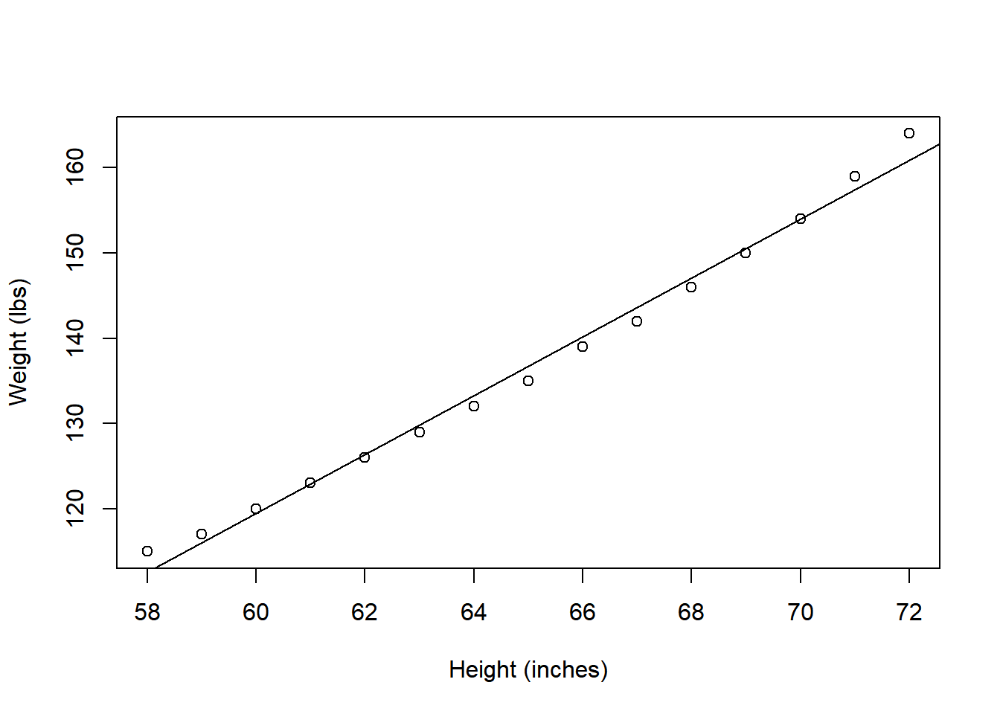
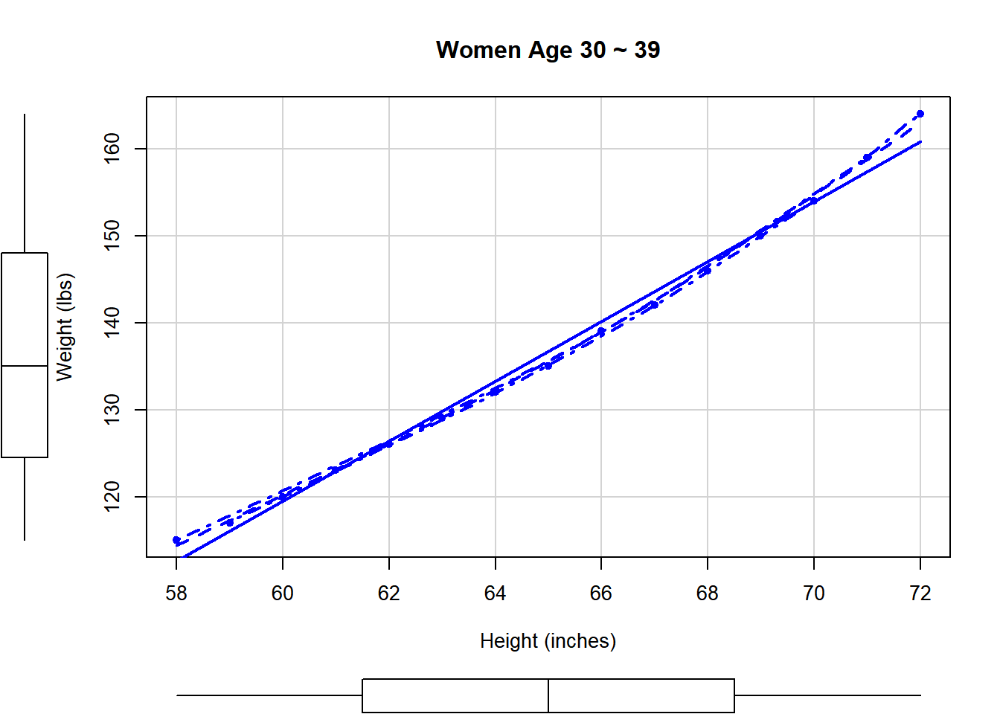
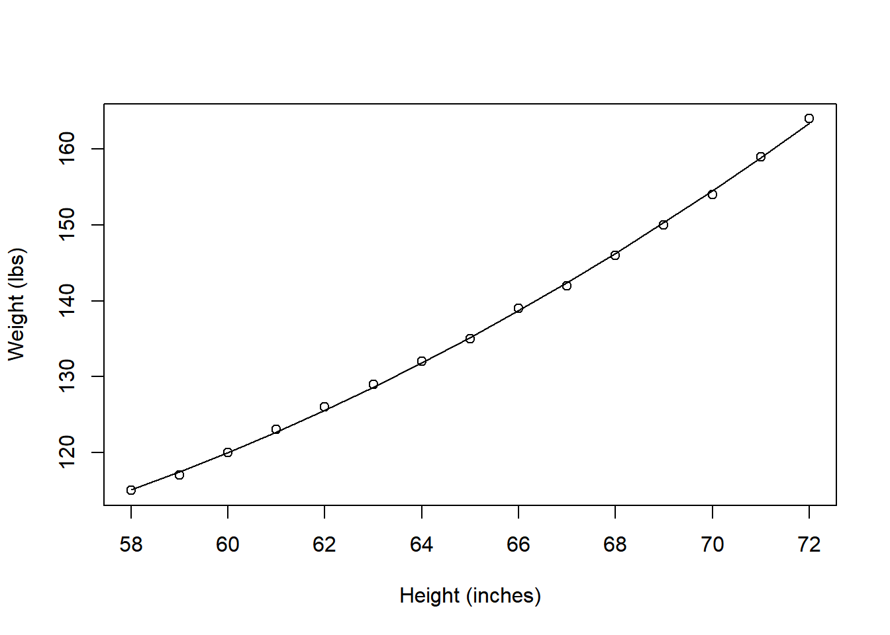

# 회귀모형(Regression Model)

## 데이터 불러오기

```r
data(women)
str(women)
```

```
## 'data.frame':	15 obs. of  2 variables:
##  $ height: num  58 59 60 61 62 63 64 65 66 67 ...
##  $ weight: num  115 117 120 123 126 129 132 135 139 142 ...
```

women(여성 데이터셋)
-height: 키(단위:in)
-weight: 몸무게(단위:lb)

R에 있는 기본 데이터셋인 women을 불러온다.

2개의 변수와 15개의 관측치가 있다.

## 상관 분석
여성의 키와 몸무게의 인과관계를 위한 회귀분석하기 전에,

두 변수의 상관성을 알아본다.

```r
cor(women$height,women$weight)
```

```
## [1] 0.9954948
```


```r
cor.test(women$height,women$weight)
```

```
## 
## 	Pearson's product-moment correlation
## 
## data:  women$height and women$weight
## t = 37.855, df = 13, p-value = 1.091e-14
## alternative hypothesis: true correlation is not equal to 0
## 95 percent confidence interval:
##  0.9860970 0.9985447
## sample estimates:
##       cor 
## 0.9954948
```

상관계수가 1에 가까울수록 두 변수의 상관력이 높다는 의미다.

0.99로 아주 높다.

##회귀모형 찾기

### 회귀모형


```r
fit1 <- lm(weight~height, data = women)
summary(fit1)
```

```
## 
## Call:
## lm(formula = weight ~ height, data = women)
## 
## Residuals:
##     Min      1Q  Median      3Q     Max 
## -1.7333 -1.1333 -0.3833  0.7417  3.1167 
## 
## Coefficients:
##              Estimate Std. Error t value Pr(>|t|)    
## (Intercept) -87.51667    5.93694  -14.74 1.71e-09 ***
## height        3.45000    0.09114   37.85 1.09e-14 ***
## ---
## Signif. codes:  0 '***' 0.001 '**' 0.01 '*' 0.05 '.' 0.1 ' ' 1
## 
## Residual standard error: 1.525 on 13 degrees of freedom
## Multiple R-squared:  0.991,	Adjusted R-squared:  0.9903 
## F-statistic:  1433 on 1 and 13 DF,  p-value: 1.091e-14
```

+ Call: 사용한 식
+ Residusals(잔차): 실제값과 오차
+ 귀무가설: 회귀계수가 0이다.
+ R-squared(결정 계수): 설명력 : 99.1% 만큼 실제값의 산포도와 일치한다.(실제 분산의 얼마만큼 잘 설명하는가)
+ 결정 계수는 주어진 종속변수(표본)과 추정한 종속변수 간의 상관계수의 제곱이다.
+ F-statistic: 귀무가설: 두 변수는 선형관계가 없다.

선형 회귀 모형의 결과, 절편과 height 통계적으로 둘 다 고도로 유의한 결과가 나왔다.

그리고 R-squared 값이 0.991로 아주 높은 값이 나와 적합한 모형이라 볼 수 있다.

모형의 결과는,

weight = -87.51667 + 3.45 x height

### plot


```r
plot(x = women$height, y = women$weight, 
     xlab = 'Height (inches)', ylab = 'Weight (lbs)')
abline(fit1)
```



실제 데이터 그래프에 회귀방정식을 그려보면,

거의 일치한 모습을 볼 수 있다.

좀 더 자세한 그래프를 그려보자.


### scatterplot


```r
library(car)
```

```
## Loading required package: carData
```

```r
scatterplot(
  weight ~ height, 
  data = women, 
  spread = FALSE, 
  smoother.args = list(lty=2), 
  pch = 19,
  main = 'Women Age 30 ~ 39',
  xlab = 'Height (inches)',
  ylab = 'Weight (lbs)' 
)
```

```
## Warning in plot.window(...): "spread" is not a graphical parameter
```

```
## Warning in plot.window(...): "smoother.args" is not a graphical parameter
```

```
## Warning in plot.xy(xy, type, ...): "spread" is not a graphical parameter
```

```
## Warning in plot.xy(xy, type, ...): "smoother.args" is not a graphical parameter
```

```
## Warning in axis(side = side, at = at, labels = labels, ...): "spread" is not a
## graphical parameter
```

```
## Warning in axis(side = side, at = at, labels = labels, ...): "smoother.args" is
## not a graphical parameter
```

```
## Warning in axis(side = side, at = at, labels = labels, ...): "spread" is not a
## graphical parameter
```

```
## Warning in axis(side = side, at = at, labels = labels, ...): "smoother.args" is
## not a graphical parameter
```

```
## Warning in box(...): "spread" is not a graphical parameter
```

```
## Warning in box(...): "smoother.args" is not a graphical parameter
```

```
## Warning in title(...): "spread" is not a graphical parameter
```

```
## Warning in title(...): "smoother.args" is not a graphical parameter
```



```r
#lty는 ling type
#회귀분석후 그래프까지 나타내줌
#회귀분석 결과를 선으로 나타난다.(평활선(loess)(smoother):모난부분을 부드럽게 해준다.)
#직선보다 더 좋게 만들 수 있다.(회귀모형에 대한 힌트를 준다.)
```

## 다항회귀모형
독립변수의 차수가 2차 이상인 회귀모형이다.


```r
fit2 <- lm(weight~height+I(height^2), data = women)
summary(fit2)
```

```
## 
## Call:
## lm(formula = weight ~ height + I(height^2), data = women)
## 
## Residuals:
##      Min       1Q   Median       3Q      Max 
## -0.50941 -0.29611 -0.00941  0.28615  0.59706 
## 
## Coefficients:
##              Estimate Std. Error t value Pr(>|t|)    
## (Intercept) 261.87818   25.19677  10.393 2.36e-07 ***
## height       -7.34832    0.77769  -9.449 6.58e-07 ***
## I(height^2)   0.08306    0.00598  13.891 9.32e-09 ***
## ---
## Signif. codes:  0 '***' 0.001 '**' 0.01 '*' 0.05 '.' 0.1 ' ' 1
## 
## Residual standard error: 0.3841 on 12 degrees of freedom
## Multiple R-squared:  0.9995,	Adjusted R-squared:  0.9994 
## F-statistic: 1.139e+04 on 2 and 12 DF,  p-value: < 2.2e-16
```

fit1과 마찬가지로 적합한 회귀모형이다.

R-squared가 조금 더 높은 것으로 보아

더 많은 데이터를 설명해줄 수 있는 모형이다.

모형의 결과는,

**weight = 261.87818 - 7.34832 x height + 0.08306 x height^2**


```r
with(data = women, expr = {
  plot(x = height, y = weight, xlab = 'Height (inches)', ylab = 'Weight (lbs)')
  lines(x = height, y = fitted(fit2))
})
```



그래프로 보았을때, 확실히 fit1보다 더 많은 데이터에 적합하다.

